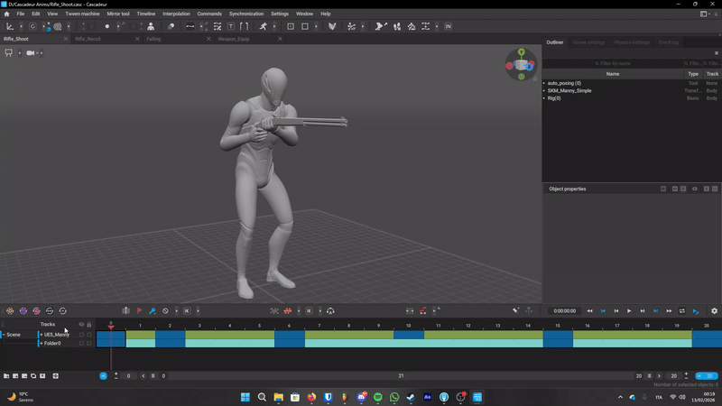
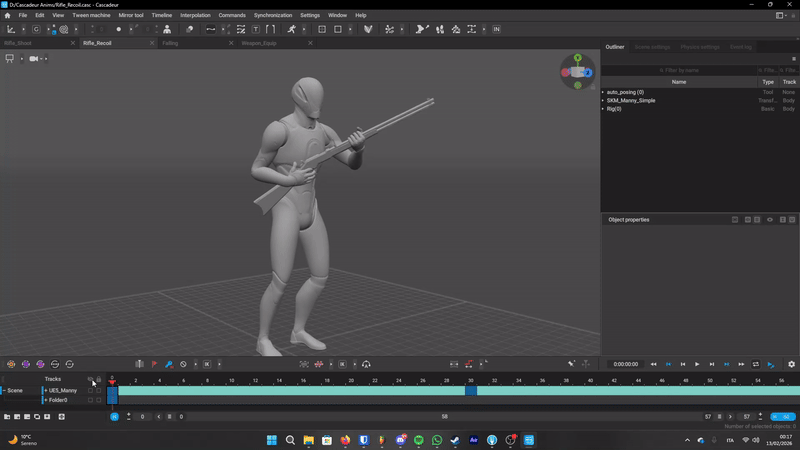
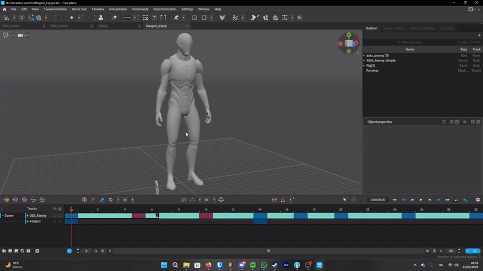
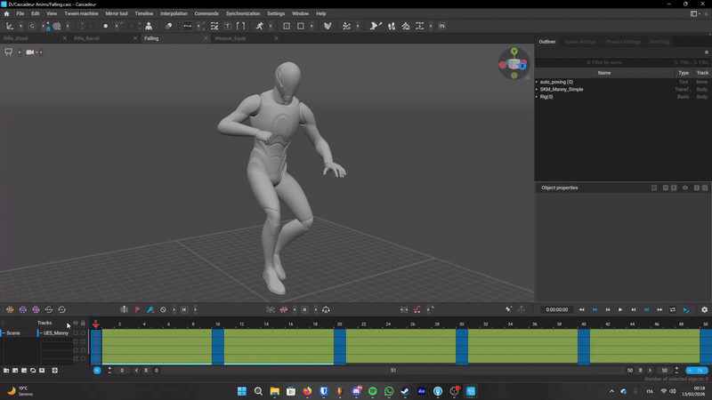

# 🕹️ TPS Animation & Systems Prototype

  A school project focused on learning the basics of <b>technical animation</b> inside of <b>Unreal Engine 5</b> and creation of gameplay animations in <b>Cascadeur</b>.

## 🎞️ The Animations (Made in Cascadeur)

<table border="0">
  <tr>
    <td width="50%" align="center">
       
      <b>Shooting</b> 
      Trying to get the kickback of the gun right.
    </td>
    <td width="50%" align="center">
       
      <b>Recoil</b> 
      Practicing how the body reacts to the shot.
    </td>
  </tr>
  <tr>
    <td width="50%" align="center">
       
      <b>Equip</b> 
      A simple transition to pull out the weapon.
    </td>
    <td width="50%" align="center">
       
      <b>Falling</b> 
      Working on a pose for when the character is in the air.
    </td>
  </tr>
</table>

---

## 🔧 Extra Stuff
* <b>Aim Offset:</b> So the character actually looks where the camera is pointing.
* <b>Hand IK:</b> Used a FABRIK node to keep the left hand stuck to the gun so it doesn't slide around.
* <b>Tools:</b> Unreal Engine 5, Cascadeur, and the UE5 Mannequin.

---
